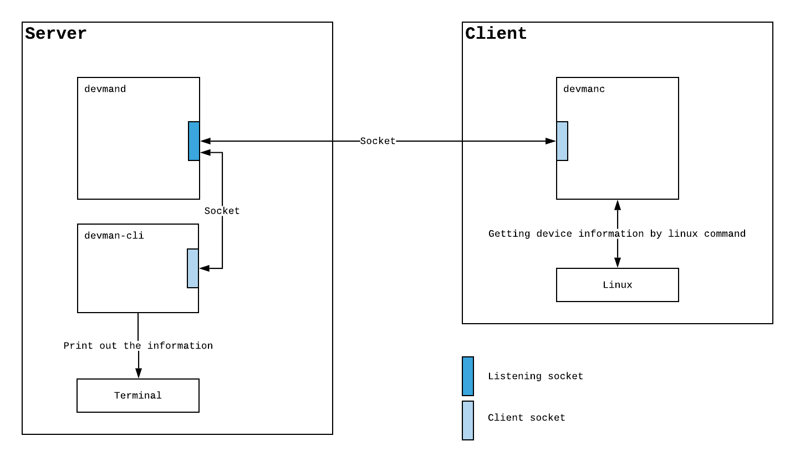
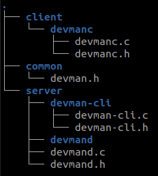
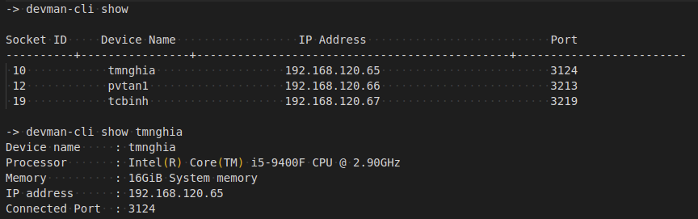

# Device Manager - DevMan
The training project for C linux programming fresher

---
# Requirements
- The project including two parts, the server-side and the client-side.
- The server-side including two programs:
  - devmand (device manager daemon): It runs in the background to collect all client information and then displays it to the terminal once required.
  - devman-cli: The user interface to interact with the devmand.
- The client-side is a program called devmanc responsible for collecting device information and then send it to the devmand.

---

# Design
## System diagram

## Data structure
- Define a device information structure.
- Define a message structure for communication via the socket.
- Using a LinkList to store the device information on the devmand.

## Example directory tree

## Server side
### The devman-cli outputs:

## Client Side
- On starting up, the devmanc will collect all required information then send it to the devmand and print out the result then exit.
